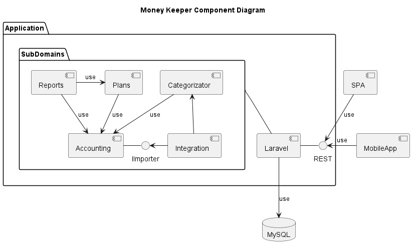

# Ubiquitous Language

* Double-entry bookkeeping - [https://en.wikipedia.org/wiki/Double-entry_bookkeeping](https://en.wikipedia.org/wiki/Double-entry_bookkeeping)
* User - id, name and email of a registed person
* Account - real or virtual account in bank, cash and etc
* Account group - group of accounts
* Transaction - information about transaction, also includes 2 transaction entries (1 for debit and 1 for credit)
* Transaction Entry - debit or credit entry of transaction
* Transaction Type - spend, income or transfer
* Transaction Category - categories of income or spends
# Architecture 

This is an attempt of implementation "some" DDD principles to personal accounting application.

## Subdomains

 
### Accounting

Main subdomain of application. It allows user to get, add, update and delete transactions.

It implements Double-entry bookkeeping method of accounting.

### Plans

Support subdomain with ability to manage spend's plans. It allows user to get, add, update and delete plan.

### Categorizator

This subdomain has a categorization service, it tries to predict category by transaction's information.

### Integrations

This subdomain has infrastructure for diffrenet integrations.

### Reports

This subdomain has a reports and dashboard services.

